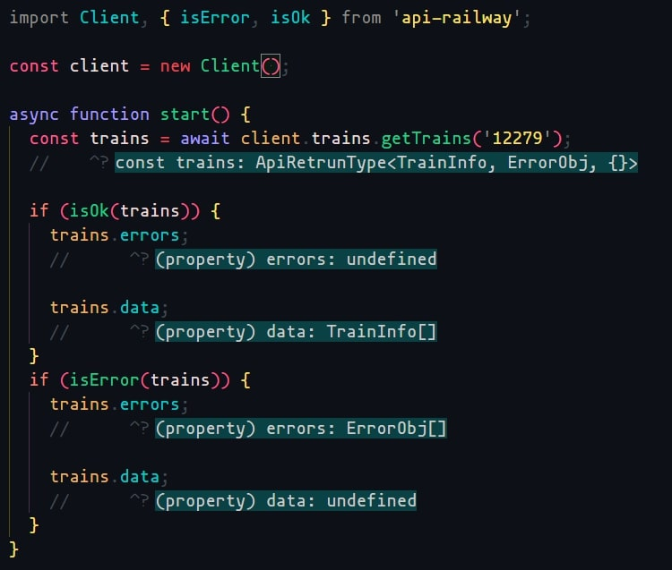
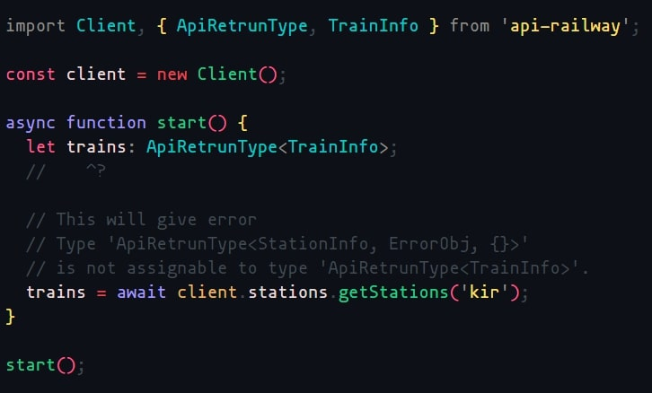

# RailwayAPI NodeJS client

This is an official [NPM](https://www.npmjs.com/package/api-railway) package that wraps [railwayapi](api.railwayapi.site) API for [NodeJS](https://nodejs.org/) with first class [Typescript](https://www.typescriptlang.org/) support.

An example project using this package can be found on [Railway Frontend Demo](https://github.com/ZennoZenith/RailwayFrontendVue)




## Installation

Install this package using `npm`

```bash
npm install api-railway
```

## Getting started

Import the module and create a new client.
You can pass different base URL, API version, protocol if you want to use different server.

```ts
import Client from 'api-railway'

const client1 = new Client()

const client2 = new Client({
  BASE_URL: 'example.com',
  API_VRSION: 'v1',
  DEFAULT_PROTOCOL: 'https',
})
```

Every REST method returns a Promise, making this library [async await](https://developer.mozilla.org/en-US/docs/Web/JavaScript/Reference/Statements/async_function) ready. Following examples will use the `await` form.

Each REST endpoint returns an object with type `ApiReturnType`

```ts
type ApiRetrunType<T extends ApiRetrunDataType, U extends ErrorObj = ErrorObj, V = {}> = {
  httpStatusCode: number
  httpStatusText: string
  responseType: ResponseType
  ok: boolean
  url: string
  responseHeaders: Headers
  data: T[] | undefined
  errors: U[] | undefined
  raw: any
  extra?: V
}
```

where `ApiRetrunDataType` is defined as

```ts
type ApiRetrunDataType =
  | ScheduleInfo
  | ScheduleRow
  | State
  | StationGeneralInfo
  | StationInfo
  | TrainGeneralInfo
  | TrainInfo
  | TrainsBtwStationsType
  | TrainType
  | Zone
```

and `ErrorObj` is defined as

```ts
type ErrorObj = {
  httpCode: number
  type: string
  code: string
  title: string
  description: string
  href: string
  path: string
  [key: string]: any
}
```

## Table of Contents

- [Init](#init)
- [Public REST Endpoints](#public-rest-endpoints)
  - [Trains](#Trains)
  - [Schedule](#Schedule)
  - [Stations](#stations)
  - [Trains between stations](#Trains-between-stations)

## Init

| Param       | Type              | Required | Default                 | Info               |
| ----------- | ----------------- | -------- | ----------------------- | ------------------ |
| API_VERSION | String            | false    | v1                      | API version to use |
| API_KEY     | String            | false    |                         |                    |
| BASE_URL    | String            | false    | api.railwayapi.site/api |                    |
| API_TIMEOUT | Number            | false    | 15000                   |                    |
| PROTOCOL    | 'http' or 'https' | false    | 'https'                 |                    |

## Public REST Endpoints

### Trains

#### Get specific train info

| Param       | Type   | Required | Default | Info                                 |
| ----------- | ------ | -------- | ------- | ------------------------------------ |
| trainNumber | String | true     |         | Train number of train to be searched |

Return type

```ts
ApiRetrunType<TrainInfo, ErrorObj>
```

Where `TrainInfo` is

```ts
type TrainInfo = {
  id: number
  trainNumber: string
  trainName: string
  trainFullName: string
  stationFrom: { stationCode: string; id: number; stationName: string }
  stationTo: { stationCode: string; id: number; stationName: string }
  departureTime: string
  arrivalTime: string
  duration: string
  trainRunsOn: TrainRunsOnType
  numberOfStops: number
  trainTypeCode: string
  distance: number
  availableClasses: string[]
  avgSpeed: number
  hasPantry: boolean
  returnTrainNumber: string
  updatedAt: string
}
```

Example:

```ts
const response = await client.trains.getTrains('12279')
```

#### Get list of train

| Param | Type   | Required | Default | Info                           |
| ----- | ------ | -------- | ------- | ------------------------------ |
| q     | String | true     |         | Query                          |
| limit | Number | false    | 10      | Number of train to be returned |

Return type

```ts
ApiRetrunType<TrainGeneralInfo, ErrorObj>
```

Where `TrainGeneralInfo` is

```ts
export type TrainGeneralInfo = {
  id: number
  trainNumber: string
  trainName: string
}
```

Example:

```ts
const response1 = await client.trains.getTrainsGeneral('122')
const response2 = await client.trains.getTrainsGeneral('122', 20)
```

### Schedule

| Param       | Type   | Required | Default | Info                                 |
| ----------- | ------ | -------- | ------- | ------------------------------------ |
| trainNumber | String | true     |         | Train number of train to be searched |

Return type

```ts
ApiRetrunType<ScheduleInfo, ErrorObj>
```

Where `ScheduleInfo` is

```ts
type ScheduleRow = {
  srNo: string
  stationId: number
  stationName: string
  stationCode: string
  arrivalTime: number | null
  departureTime: string | null
  distance: string
  haltTime: string | null
  dayCount: number
  platform: string | null
  boardingDisabled: boolean
  speed: string
}
```

Example:

```ts
const response = await client.schedules.getSchedules('12279')
```

### Stations

#### Get station

| Param       | Type   | Required | Default | Info                                   |
| ----------- | ------ | -------- | ------- | -------------------------------------- |
| stationCode | String | true     |         | Station code of station to be searched |

Return type

```ts
ApiRetrunType<StationInfo, ErrorObj>
```

Where `StationInfo` is

```ts
type StationInfo = {
  id: number
  stationCode: string
  stationName: string
  stateName: string
  stationType: string
  numberOfPlatforms: number
  hindiStationName: string
  zones: { zoneName: string; zoneCode: string }
  latitude: string
  longitude: string
  updatedAt: string
}
```

Example:

```ts
const response = await client.stations.getStations('NZM')
```

#### Get station list

| Param | Type   | Required | Default | Info  |
| ----- | ------ | -------- | ------- | ----- |
| q     | String | true     |         | Query |
| limit | Number | false    | 10      |       |

Return type

```ts
ApiRetrunType<StationGeneralInfo, ErrorObj>
```

Where `StationGeneralInfo` is

```ts
type StationGeneralInfo = {
  id: number
  stationCode: string
  stationName: string
}
```

Example:

```ts
const response = await client.stations.getStationsGeneral('N')
```

### Trains-between-stations

| Param           | Type   | Required | Default | Info              |
| --------------- | ------ | -------- | ------- | ----------------- |
| fromStationCode | String | true     |         | From station code |
| toStationCode   | String | true     |         | To station code   |
| date            | String | false    |         |                   |

Return type

```ts
ApiRetrunType<TrainsBtwStationsType, ErrorObj, TrainsBtwStationsExtraType>
```

Where `TrainsBtwStationsType`, `TrainsBtwStationsExtraType`, and `StationInfo` is

```ts
type TrainsBtwStationsType = {
  id: number
  trainNumber: string
  trainName: string
  trainFullName: string
  trainRunsOn: TrainRunsOnType
  availableClasses: string[]
  hasPantry: boolean
  trainType: string
  returnTrainNumber: string
  stationFrom: StationStop
  stationTo: StationStop
  updatedAt: string
  distance: number
  duration: string
}

type TrainsBtwStationsExtraType = {
  stationsInfo: StationInfo[]
}

type StationInfo = {
  id: number
  stationCode: string
  stationName: string
  stateName: string
  zoneCode: string
  stationType: string
  hindiStationName: string
}
```

Example:

```ts
const response = await client.trainsBtwStations.getTrainsBtweenStations('NZM', 'GWL')
```
